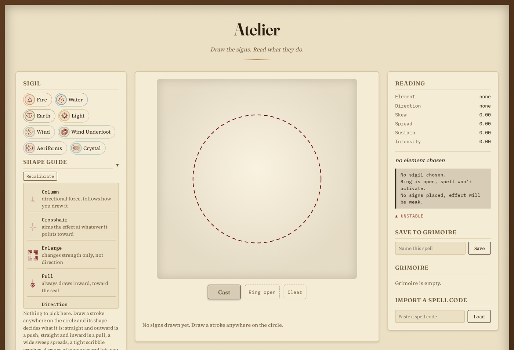
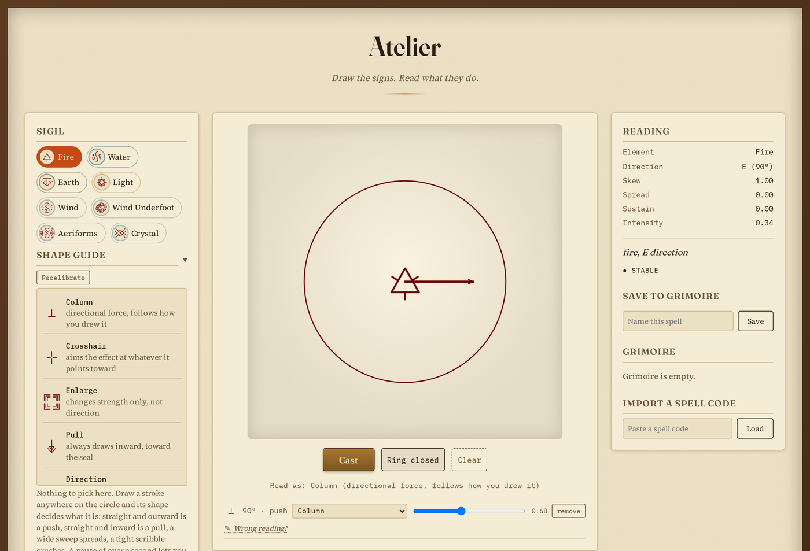
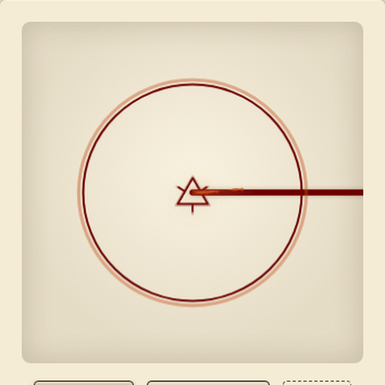
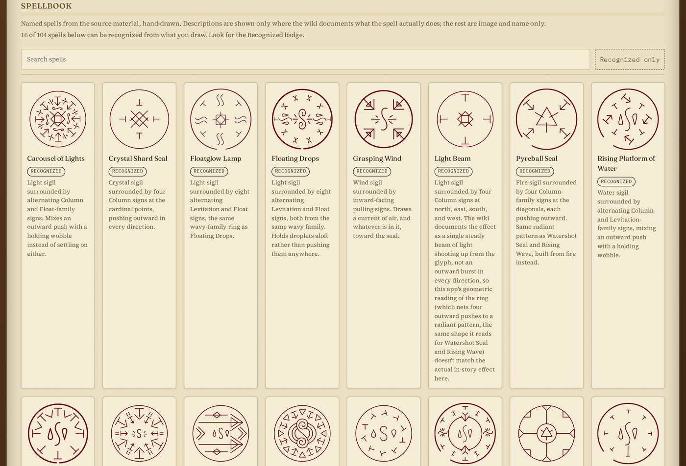
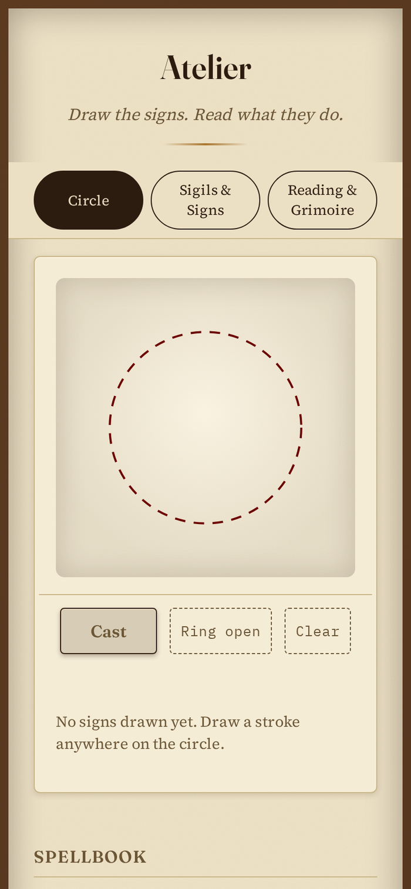

# Atelier

A spell circle workbench in the style of Witch Hat Atelier's magic system. Pick an element, draw signs freehand anywhere on the circle, close the ring, and read what the composition resolves to.

Try it: https://yatovoid.github.io/witch-atelier/

No build step, no backend. Static HTML, CSS, and JavaScript, deployable as is to GitHub Pages.



## What it does

Nothing is pre-selected before you draw. Draw a stroke anywhere on the circle and its shape decides what sign it is: straight and outward is a push, straight and inward is a pull, a wide sweep spreads, a tight scribble crushes. Close the ring and cast to see the effect play out on the circle itself.





- 8 elements, 24 signs. No shape is hardcoded to one element or one spell.
- Recognizes drawn signs from their geometry alone. No server call, no model file.
- Composes direction, spread, sustain, and intensity from whatever was actually drawn, not a lookup table.
- Matches recognized compositions against 104 named spells pulled from the source material.
- Personal calibration flow to teach the recognizer your own handwriting.
- The cast animation reacts to what you drew: particle count, speed, spread, and a real tilted perspective all follow the composed spell instead of playing one fixed effect per element.
- Save spells to a local grimoire, export and import them as a short code.



Works on a phone too, panels become swipeable tabs below a certain width.



## Fan project notice

This is an unofficial fan project made for fun. It is not affiliated with, endorsed by, or sponsored by the creators, publishers, or rights holders of Witch Hat Atelier. The sigils, signs, spell terminology, and visual effects here are fan interpretations, not official assets or canonical rules. The sigil and sign glyphs in `assets/` are hand-drawn reconstructions of the canon designs, not traced from the manga's published pages.

## Current limitations

- One spell ring at a time. Multiple or nested rings aren't supported.
- One sigil per circle. The engine expects exactly one primary element.
- Recognition is template based, not a trained model. Clean, deliberate strokes work best.
- Only 16 of the 104 spellbook entries are recognizable from what you draw right now. The rest are reference images only, their sign composition isn't confirmed closely enough to match against.
- The cast animation is an interpretive effect, not a reproduction of the manga or anime's own visuals.

## Run locally

```
python3 -m http.server 8000
```

Open `http://localhost:8000`.

## How it works

Draw one or more strokes anywhere on the circle (a pause of 1.5s locks the sign in, so a few strokes drawn close together count as one sign) and the shape decides which family it belongs to:

| Shape | Family |
|---|---|
| straight, drawn outward | Column, Crosshair, Enlarge, or Levitation |
| straight, drawn inward | Pull |
| wide sweep, outward | Dispersion, Radial, Rain, Billowing, or Weave |
| wide sweep, inward | Convergence, Window, or Collection |
| gentle wiggle that doesn't travel far | Float, Dancing Puppet, or Vision |
| sharp zigzag | Bolt, Bend, Direction, or Bird |
| closed loop, smooth | Diamond, Repetition, or Eye |
| closed loop, chaotic | Crush |

There's no shape difference between the signs within a family in the source material either. The stroke narrows it to a family; the sign list row's dropdown lets you pick which one you meant.

### Files

- **`js/engine/classify.js`**: reads a sign's stroke geometry and returns a family plus its default member. Closedness is read directly off the raw geometry. Direction (outward vs. inward) compares the ring center distance of the longest stroke's start to its end, not first-stroke-to-last-stroke, so a decoration drawn as its own stroke can't flip the reading. Everything else (straight line vs. corner vs. zigzag vs. wiggle) goes through a point cloud shape matcher, the $1 Unistroke Recognizer (Wobbrock, Wilson & Li, 2007): the stroke is normalized (resampled, recentered, rescaled, rotated to a consistent orientation) and matched against reference examples in `js/data/templates.js`. Angular spread around the ring center is only checked once shape matching fails to find a confident match, to catch a genuine wide sweep without misreading a long armed peak or zigzag as one. Deterministic, no network call, no model file. `classifyStrokeGroup()` takes an optional pool of extra templates from `js/training.js`. Direction isn't trainable the same way, it's a geometric comparison, not a template match.
- **`js/data/templates.js`**: reference examples for the shape matcher, one point array per shape. `straight`, `bend`, `bolt`, and `wavy` each carry templates traced off the actual glyph art in `assets/signs/*.webp`, alongside clean geometric templates and real hand-drawn examples. Add templates here to fix a shape that's still misread.
- **`js/training.js`**: personal corrections, saved to `localStorage`. The "Wrong reading?" panel lists every sign directly; for shape-matched families it also saves the drawn stroke as an extra template. A multi-stroke sign radiating from a shared center (a Crosshair's four arms) is saved one arm per entry. `js/app.js` also offers a one-time calibration flow on first visit.
- **`js/data/signatures.js`**: recognizes a drawn spell as a named spellbook entry, for the signatures whose sign composition is confirmed (documented on the wiki or read off the reference art).
- **`js/data/sigils.js`**: the 8 elements.
- **`js/data/signs.js`**: the 24 sign archetypes. Each has a `contribute(accumulator, instance)` function describing its effect on direction, spread, sustain, or intensity. Where the wiki doesn't document a sign's function, the entry says so and uses a placeholder grouped by feel.
- **`js/data/spellbook.js`**: 104 named canon spells for the reference gallery. Descriptions are included only where the wiki documents the effect.
- **`js/engine/compose.js`**: pure function reducing a chosen sigil and drawn signs into resolved parameters (direction, magnitude, spread, sustain, intensity) and misfire warnings.
- **`js/engine/render.js`**: canvas rendering, ink color sampled from the reference artwork.
- **`js/engine/vector.js`**: angle and compass bearing math.
- **`js/grimoire.js`**: localStorage persistence and spell-code export/import.

Direction and strength are computed, not looked up: each directional sign contributes a force vector from its angle and drawn length, summed for the net reading. Nothing about a specific element times sign combination is hardcoded.

## The artwork

The sigil and sign glyphs in `assets/` are hand-drawn reconstructions of the canon designs, not traced from the manga's published pages.

## Adding a new sigil or sign

- **New element**: add an entry to `SIGILS` in `js/data/sigils.js` (name, particle style, image path).
- **New sign archetype**: add an entry to `SIGN_ARCHETYPES` in `js/data/signs.js` with a `contribute()` function and image path, and place it in `SIGN_BUCKETS` in `js/engine/classify.js`.
- **New spellbook entry**: add a row to `SPELLBOOK` in `js/data/spellbook.js`, with a `description` only if the wiki documents what it does.

## Testing the recognition engine

`test/run.js` is a plain Node script with no dependencies: it loads the engine files the same way `index.html` does and drives them with synthetic stroke geometry. Covers every sign family at several ring positions, jitter robustness at plausible hand-tremor levels, real hand-drawn examples traced from actual misclassifications, and every `SPELL_SIGNATURES` entry against its recipe and near-miss recipes that should be rejected.

Run with `node test/run.js`.

## Deploying to GitHub Pages

1. `git init`, commit, push to a GitHub repo.
2. In the repo's Settings, Pages, set the source to the `master` branch, root directory.
3. No Actions workflow needed, there's no build step.

## License

MIT for the code in this repository. See `LICENSE`. The Witch Hat Atelier characters, world, and terminology are not covered by this license and belong to their own rights holders, see the fan project notice above.
